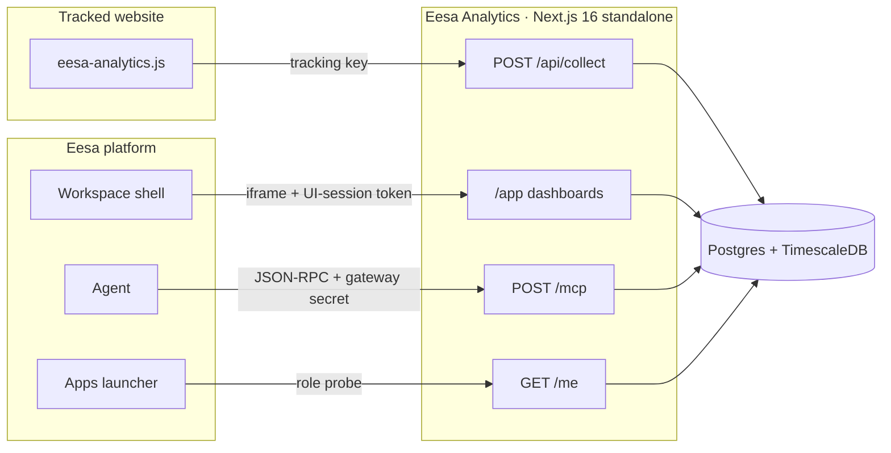

# Eesa Analytics

> Product analytics, heatmaps, and session replay — multi-tenant, self-hosted,
> and embedded straight into the Eesa workspace.


This is a **federated Eesa plugin**, not a standalone SaaS. It runs as its own
container with its own database, and Eesa brokers every authenticated call to
it — the workspace shell frames its dashboards, the agent calls its MCP tools,
and the Apps launcher asks it who the current user is. Tenancy comes from the
token on each request and is never read from the request body.

---

## Two planes

The service does two very different jobs, with two different trust models.
Keeping them separate is the whole security design.

| | **Ingest plane** | **Dashboard plane** |
|---|---|---|
| Who calls it | Anonymous browsers on tracked sites | Signed-in Eesa users and the Eesa agent |
| Credential | Per-site **tracking key** (`data-site`) | **Eesa-issued JWT**, verified against the platform JWKS |
| Endpoints | `POST /api/collect`, `POST /api/rec` | `/app/*`, `/api/*`, `/mcp`, `/me` |
| Trust | Untrusted — origin-checked, key-scoped | Trusted — tenant + role come from the token |

---

## Architecture



---

## Platform surfaces

The four routes below are the contract Eesa depends on. They live at the
**root**, not under `/api` — the `/api/*` routes are the dashboard's own data
layer plus the public ingest endpoints.

| Route | Method | Auth | Purpose |
|---|---|---|---|
| `/health` | `GET` | none | Liveness + DB reachability. The publishing pipeline polls it after deploy. |
| `/manifest` | `GET` | none | Serves [`manifest.json`](manifest.json) at runtime, for registration. |
| `/mcp` | `POST` | gateway secret + `mcp` token | JSON-RPC for the agent: `traffic_summary`, `top_pages`, `funnel_report`. |
| `/me` | `GET` | `ui` session token | Role probe. Decides whether the app appears in a user's launcher. |
| `/app/*` | `GET` | `ui` session token (cookie bridge) | The embedded dashboard. `/` redirects here. |
| `/api/collect` · `/api/rec` | `POST` | tracking key | Public ingest: events and session-replay chunks. |
| `/eesa-analytics.js` | `GET` | none | The 11 KB tracking snippet served to customer sites. |

---

## Dashboard

| Screen | Route |
|---|---|
| Overview — KPI tiles, traffic trend, sources, top pages, live activity | `/app` |
| Visitors | `/app/visitors` |
| Heatmaps — click / attention / scroll | `/app/heatmaps` |
| Session replay — list and player | `/app/sessions`, `/app/sessions/[id]` |
| Funnels — conversion and per-step drop-off | `/app/funnels` |
| Goals — tenant-defined conversions | `/app/goals` |
| Install — copy the one-line snippet | `/app/install` |

Installing on a customer site is a single tag:

```html
<script src="https://analytics.example.com/eesa-analytics.js" data-site="TRACKING_KEY" defer></script>
```

---

## Identifying visitors

Visitors are anonymous by default, tracked per device. When the site knows who
someone is, it says so once — and everything that device already did becomes
theirs.

```js
eesa.identify('cust_1042');   // your own id, opaque to us
eesa.reset();                 // on logout
eesa('purchase', { order_id: 'ord_88121', value: 42.50 });
```

Call `identify()` in **two** places: when your login succeeds, and on any page
load where the visitor is already signed in. Skip the second and a returning
customer stays anonymous until the next time they happen to log in.

The pre-login history is claimed **without rewriting anything**. Events keep the
`user_id` they were captured with — usually empty — and the link lands in
`identities`, which the read path resolves through. `events` is a hypertable
behind a continuous aggregate: updating a visitor's rows on every sign-in would
spray writes across chunks and leave already-materialised hourly buckets
disagreeing with the raw rows beneath them. One mapping row covers that
visitor's whole history instead, reaches further back than any backfill window
would, and is undone by deleting it.

`reset()` also rotates the device id, so the next person on a shared computer
starts as a new anonymous visitor rather than as whoever signed in last.

Use a stable internal id. Not an email — it would sit in the visitor's own
browser storage and in this database for no benefit — and never a guest or
temporary id, since an id that changes turns one person into two.

---

## Data model

Schema lives in [`db/schema.sql`](db/schema.sql) — apply it to the plugin's own
database before first boot.

| Table | Notes |
|---|---|
| `sites` | Tracked sites, tracking keys, allowed origins |
| `events` | The firehose. **TimescaleDB hypertable**, 7-day chunks on `ts` |
| `identities` | Visitor→user links. What makes `identify()` reach backwards |
| `funnels` | Tenant-defined funnel step definitions |
| `goals` | Tenant-defined conversions |
| `recordings` | Session-replay metadata (rrweb) |
| `members` | Local mirror of the Eesa-assigned role |

Every table is keyed by `tenant_id`, and every query is scoped by the tenant
resolved from the caller's token.

---

## Auth and roles

Tokens are verified with [`jose`](https://github.com/panva/jose) against the
platform JWKS (`EESA_JWKS_URL`, issuer `EESA_TOKEN_ISSUER`). Each token carries
a **surface** — `mcp` for the agent, `ui` for the dashboard — and a surface
mismatch is rejected. The `/mcp` route additionally requires the shared
`PLUGIN_GATEWAY_SECRET`, so the agent path can only be entered through the
gateway.

Eesa is authoritative on access. It stamps an `appRole` claim:

| `appRole` | Access |
|---|---|
| `admin` | Read dashboards, manage sites, rotate tracking keys |
| `staff` | Read dashboards |
| `none` | `403` — Eesa then hides the app from that user's launcher |

When the claim is **absent** the tenant has no roster yet, so any authenticated
tenant member is treated as an admin. That fallback is deliberate: the app
shipped before per-user access existed, and deny-by-default would have locked
out every team already using it.

---

## Configuration

Copy [`.env.example`](.env.example) to `.env.local` for local runs. In
production the publishing pipeline injects the platform group **last**, so a
plugin cannot override its own auth contract.

**Platform-injected**

| Variable | Purpose |
|---|---|
| `EESA_JWKS_URL` | Public keys used to verify Eesa tokens |
| `EESA_TOKEN_ISSUER` | Expected `iss` claim |
| `PLUGIN_GATEWAY_SECRET` | Shared secret for `/mcp`; must match the platform connection |
| `EESA_API_BASE` | Eesa API base for callbacks |
| `PORT` | Listen port (default `8080`) |

**Plugin-owned**

| Variable | Purpose |
|---|---|
| `DATABASE_URL` | Postgres/TimescaleDB connection string |
| `PGSSL` | `no-verify` for managed PG, `disable` for local plaintext |
| `PG_POOL_MAX` | Pool ceiling (default `10`) |
| `EESA_FRAME_ANCESTORS` | Origins allowed to frame the dashboard |
| `UPSTASH_REDIS_REST_*` | Optional live "active now" plane |
| `S3_*` | Session-replay object storage (reserved) |
| `PLUGIN_ENC_KEY` | AES-256-GCM key for secrets at rest (reserved) |

---

## Run it

```bash
npm install
cp .env.example .env.local          # then fill DATABASE_URL
psql "$DATABASE_URL" -f db/schema.sql

npm run dev                          # http://localhost:3000
npx tsc --noEmit                     # typecheck
npm run lint
npm run build                        # production build
```

---

## Deploy

The [`Dockerfile`](Dockerfile) is a three-stage build producing a Next.js
**standalone** server, built by the publishing pipeline with the `dockerfile`
buildpack.

> **Gotcha worth keeping.** Next standalone binds to
> `process.env.HOSTNAME || '0.0.0.0'`, and Docker sets `HOSTNAME` to the
> container ID. Without the explicit `ENV HOSTNAME=0.0.0.0` in the Dockerfile,
> the server binds to the container-ID hostname and the proxy gets a permanent
> 502 on every path.

After the container is healthy, register it with Eesa: super-admin →
**`/admin/mcp-servers`** → **Register plugin** → paste `manifest.json`. That
writes the MCP, UI, and REST surfaces onto the platform connection and syncs
the agent tools.

**The manifest's URLs must match the host you actually deployed to.** The
platform stores those values verbatim and frames whatever `surfaces.ui.url`
says — a stale host there is indistinguishable, from the user's side, from a
broken plugin.

---

## Where it stands

**Working end to end:** the tracking snippet, event ingest, session-replay
capture (rrweb), live dashboards over real data, tenant-defined funnels and
goals, the three MCP tools, and the role probe.

**Reserved, not yet wired:** S3 replay storage (`S3_*` blank), the Upstash live
plane (optional), and `PLUGIN_ENC_KEY`.

---

## Stack

Next.js 16 (App Router) · React 19 · TypeScript 5 · Tailwind v4 · shadcn/ui on
Base UI · `pg` · `jose` · rrweb · hand-built SVG charts (no chart library, so
every mark matches the brand).
